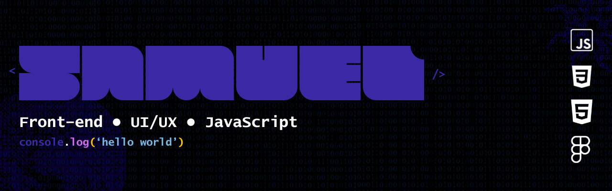

# Samuel

Estudante de **Análise e Desenvolvimento de Sistemas**, atualmente no **2º semestre**, com foco em desenvolvimento web e construção de uma base sólida em Engenharia de Software.

Atualmente estudo **HTML, CSS, JavaScript** e **UI/UX Design**, desenvolvendo projetos práticos para aprimorar lógica de programação, arquitetura de aplicações, boas práticas de desenvolvimento e versionamento de código com Git.

Meu objetivo é iniciar minha carreira na área de Tecnologia da Informação, evoluindo continuamente por meio de projetos, estudos e experiências práticas.

---

## Sobre

- Estudante de ADS
- Foco em Desenvolvimento Web
- Usuário Linux
- Interesse em Front-end, UI/UX e Engenharia de Software
- Aprendizado contínuo por meio de projetos pessoais

---

## Tecnologias

  
  
  
  
  
  
  
  

---

## Atualmente estudando

- JavaScript (ES6+)
- Desenvolvimento Web
- UI/UX Design com Figma
- Estruturas de Dados
- Algoritmos
- Git e GitHub
- APIs REST
- Node.js

---

## Projetos em destaque

Em breve esta seção reunirá meus principais projetos públicos.

- **ZUME** *(em desenvolvimento)*  
  Plataforma voltada para organização dos estudos e produtividade, desenvolvida como projeto principal de aprendizado.

---

## Estatísticas

  

  

  

---

## Contato

