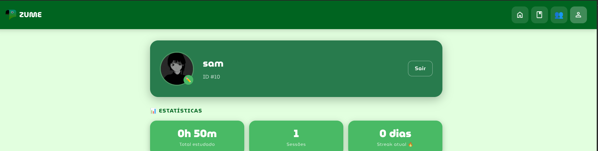
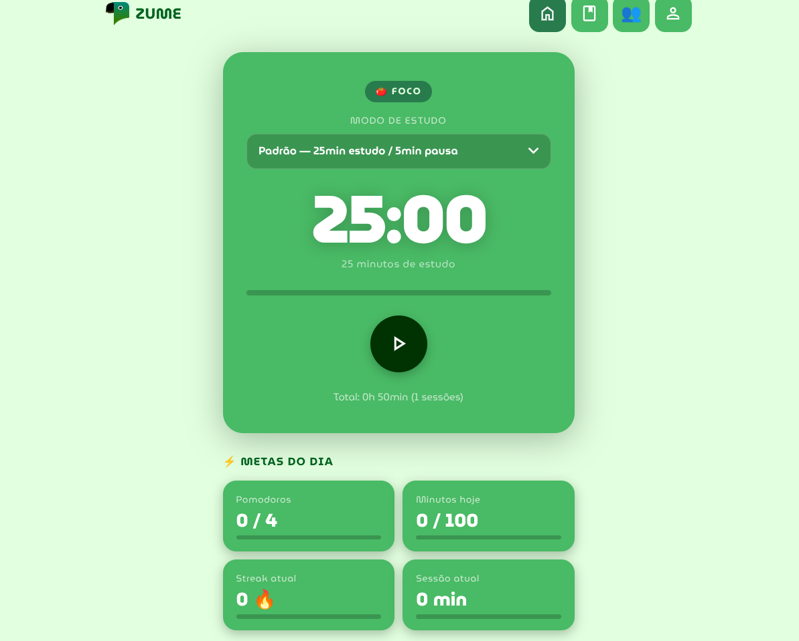

# Samuel

Estudante de **Análise e Desenvolvimento de Sistemas (2º semestre)** com foco em desenvolvimento web e construção de software.

Atualmente estou desenvolvendo uma base sólida em **HTML, CSS, JavaScript** e **Node.js**, enquanto aprofundo conhecimentos em estruturas de dados, algoritmos, APIs REST e boas práticas de desenvolvimento.

Meu foco é desenvolver aplicações web completas, aplicando boas práticas de programação, arquitetura de software e versionamento, enquanto construo um portfólio sólido para ingressar profissionalmente na área de Tecnologia.

---

## Sobre

- Estudante de Análise e Desenvolvimento de Sistemas
- Desenvolvedor Front-end em formação
- Entusiasta de Linux e Software Livre
- Construindo projetos próprios para consolidar conhecimentos
- Aprendendo continuamente através da prática

---

## Tecnologias

---

## Projeto em destaque

### ZUME — Plataforma de estudos

 

  

  

---

ZUME é uma plataforma web voltada à organização dos estudos e ao aumento da produtividade, reunindo ferramentas como Pomodoro, Flashcards, autenticação de usuários e recursos de colaboração em tempo real.

O projeto reúne ferramentas como Pomodoro, Flashcards e autenticação de usuários, além de uma arquitetura com frontend e backend em Node.js.

<a href="https://sam-zume.netlify.app" target="_blank" > 🌐 Demonstração </a> • <a href="https://github.com/sam77g/ZUME" target="_blank" > 📂 Repositório </a>

## Stack do projeto
#### Frontend
- React 18 + Vite
- React Router DOM
- Socket.io Client
- Marked.js + MathJax (renderização de Markdown e LaTeX)
- PDF.js (extração de texto de PDFs)

#### Backend
- Node.js + Express
- Socket.io (salas de foco em tempo real)
- PostgreSQL via Supabase (pg)
- JWT (autenticação)
- bcrypt (hash de senhas)
- Zod (validação de entrada)
- Helmet + rate-limit (segurança)
### Em desenvolvimento
- Integração com IA utilizando a API da Groq (Llama 3 8B)

## Funcionalidades

- **Timer Pomodoro** com modos de foco e pausa customizáveis
- **Salas de foco colaborativas** — estude em tempo real com outros usuários via WebSocket
- **Gerador de conteúdo com IA** — resumos e roteiros de estudo a partir de texto ou PDF
- **Histórico de sessões** com dashboard de progresso
- **Autenticação completa** — cadastro, login e rotas protegidas por JWT

---

## Atualmente estudando

- JavaScript (ES6+)
- Node.js
- APIs REST
- Git e GitHub
- Estruturas de Dados
- Algoritmos
- UI/UX Design
- Arquitetura de aplicações web

---

## GitHub

  

---

## Contato

