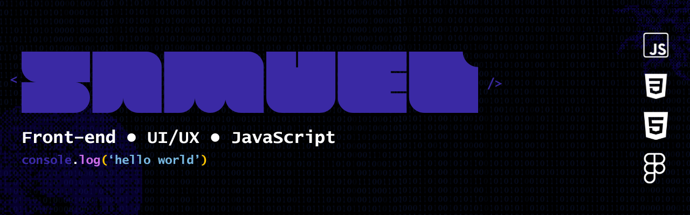

# Samuel

Estudante de **Análise e Desenvolvimento de Sistemas (2º semestre)** com foco em desenvolvimento web e construção de software.

Atualmente estou desenvolvendo uma base sólida em **HTML, CSS, JavaScript** e **Node.js**, enquanto aprofundo conhecimentos em estruturas de dados, algoritmos, APIs REST e boas práticas de desenvolvimento.

Meu foco é desenvolver aplicações web completas, aplicando boas práticas de programação, arquitetura de software e versionamento, enquanto construo um portfólio sólido para ingressar profissionalmente na área de Tecnologia.

---

## Sobre

- Estudante de Análise e Desenvolvimento de Sistemas
- Desenvolvedor Front-end em formação
- Entusiasta de Linux e Software Livre
- Construindo projetos próprios para consolidar conhecimentos
- Aprendendo continuamente através da prática

---

## Atualmente estudando

- JavaScript (ES6+)
- Node.js
- APIs REST
- Git e GitHub
- Estruturas de Dados
- Algoritmos
- UI/UX Design
- Arquitetura de aplicações web

---

## Stats

  

  <picture>
    <source
      srcset="https://github-stats-extended.vercel.app/api/top-langs/?username=sam77g&langs_count=4&theme=dark_github"
      media="(prefers-color-scheme: dark)"
    />
    
  </picture>

---

## Contato

